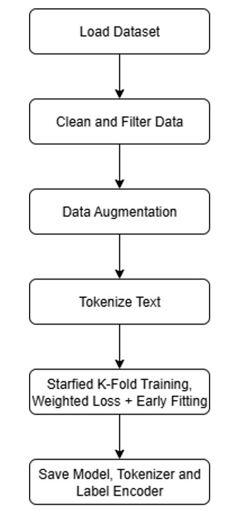

# resume-classifier

## Summary

&nbsp;&nbsp;&nbsp;&nbsp;&nbsp;&nbsp;&nbsp;&nbsp;&nbsp;&nbsp;&nbsp;&nbsp; This project is a smart system that reads a resume and predicts the most suitable job titles for it. It uses a machine learning model (bert-base-uncased) that has been trained to understand resumes and match them to job categories. To train the model, I use a process called cross-validation, which helps make sure the model works well on different kinds of data. I also add a small amount of extra data by replacing words in resumes with their synonyms to help the model learn better. During training, we track how well the model is doing using accuracy and F1 score, and we save charts showing its progress.
&nbsp;&nbsp;&nbsp;&nbsp;&nbsp;&nbsp;&nbsp;&nbsp;&nbsp;&nbsp;&nbsp;&nbsp; Once trained, the model can be used to make predictions. There’s a web app where users can upload their resume as a PDF or text file. The app reads the text from the resume and sends it to a backend server, which runs the model and returns the top 5 job titles that match the resume best. This backend is built using FastAPI and loads the model just once when it starts, so it can give fast answers. The whole system is organized into different parts (like training, prediction, logging, and the user interface) to keep it clean and easy to manage. 

**Algorithm:** Transformer-based Text Classification (e.g., BERT, DeBERTa), Stratified 5-Fold Cross-Validation   
**Framework:** PyTorch, Hugging Face Transformers, FastAPI, Streamlit   
**Support Libraries:** transformers, torch, evaluate, scikit-learn, pdfplumber, fitz, matplotlib, pandas, nlpaug   
**File handling & paths:** pdfplumber, PyMuPDF (fitz)   
**Evaluation:** Accuracy, F1-score (macro), Confusion Matrix    

## 📊 Model Development Flowchart

## 📊 Frontend Flowchart
   
